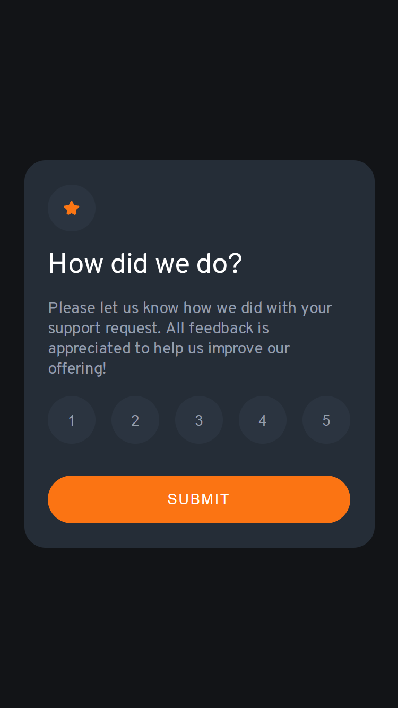

# Frontend Mentor - Interactive rating component solution

This is a solution to the [Interactive rating component challenge on Frontend Mentor](https://www.frontendmentor.io/challenges/interactive-rating-component-koxpeBUmI).

## Table of contents

- [Overview](#overview)
  - [The challenge](#the-challenge)
  - [Screenshot](#screenshot)
  - [Links](#links)
- [My process](#my-process)
  - [Built with](#built-with)
  - [What I learned](#what-i-learned)
  - [Useful resources](#useful-resources)
- [Author](#author)

## Overview

### The challenge

Users should be able to:

- View the optimal layout for the app depending on their device's screen size
- See hover states for all interactive elements on the page
- Select and submit a number rating
- See the "Thank you" card state after submitting a rating

### Screenshot

Desktop screenshot


Mobile screenshot



### Links

- Solution URL: [Repository](https://github.com/kushagarwal11ag/interactive-rating)
- Live Site URL: [Website](https://kushagarwal11ag.github.io/interactive-rating/)

## My process

### Built with

- Semantic HTML5 markup
- CSS custom properties
- JavaScript
- Flexbox
- Mobile-first workflow

### What I learned

Learned to apply basic JavaScript skills with this project and got a better view on its powerful capabilities.

```html
<section>
	<button onclick="storeValue('1')">1</button>
  <button class="submit" onclick="performOperation()">SUBMIT</button>
</section>

<div>
	You selected <span class="rating-result"></span> out of 5
</div>
```

```js
let result = document.querySelector(".rating-result");
let newValue = undefined;

function storeValue(value) {
	newValue = undefined;
	newValue = value;
}

function performOperation() {
	if (newValue) {
		result.innerHTML = newValue;
	}
}
```

In above code, we store value of '1' in function: "storeValue()" when button is clicked.
And when user clicks on 'Submit' button, it displays the value on webpage.

### Useful resources

- [Active button state](https://stackoverflow.com/questions/31178653/how-to-keep-active-css-style-after-click-a-button) - This helped me to learn how to keep button in active state (color change) after it is being clicked and remove that state when another button is clicked.

## Author

- Frontend Mentor - [@kushagarwal11ag](https://www.frontendmentor.io/profile/kushagarwal11ag)